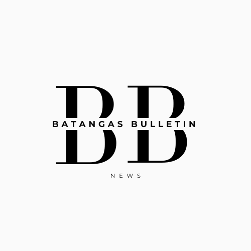

## About Batangas Bulletin

Tired of reading the same ol' unreliable news? Don't fret, as Batangas Bulletin is here to save you from the headache! A blog deprived of unreliable & unverified news, Batangas Bulletin it is!

## License

Batangas Bulletin is an open-sourced software licensed under the [MIT license](https://opensource.org/licenses/MIT).
